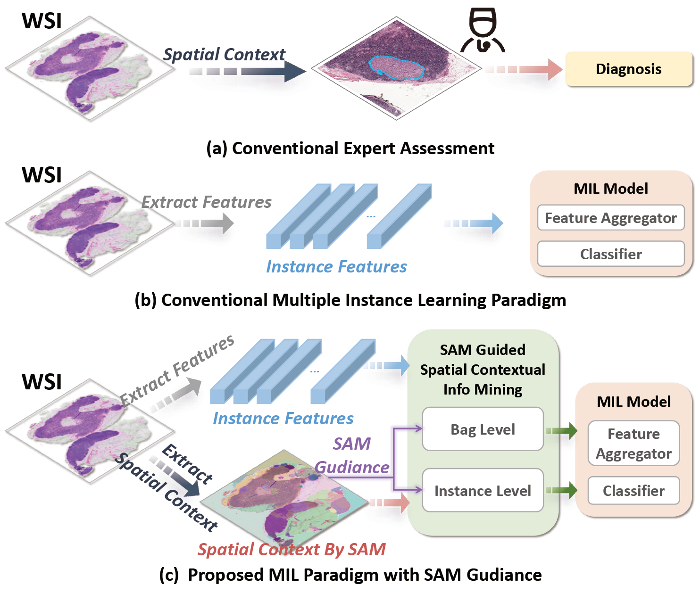

# SAM-MIL (Updating)

Official repository of "**SAM-MIL: A Spatial Contextual Aware Multiple Instance Learning Approach for Whole Slide Image Classification**", ACM Multimedia 2024. 
[[arXiv]](https://arxiv.org/abs/2407.17689) 
[[PDF]](https://arxiv.org/pdf/2407.17689)

[//]: # ([[ACM]]&#40;&#41;)

<p align = "center">

</p>

## TODO

- [x] Add the code for the training and testing of the model.
- [x] Add the code for the preprocessing of the datasets.
- [x] Add the code for the visualization of the results.
- [ ] Improving the visualization code.
- [ ] Add the extracted features of the datasets(Camelyon16, TCGA-NSCLC).
- [ ] Improving README document.
- [ ] Improving the code structure.

## Preparation

We used the Segment Anything Model from the [official repository](https://github.com/facebookresearch/segment-anything) to implement visual segmentation of WSIs.

- The weights used in the experiment can be found [here](https://dl.fbaipublicfiles.com/segment_anything/sam_vit_h_4b8939.pth). 
- We used sam_vit_h as the backbone model for the segmentation task.

## Preprocessing

The preprocessing code can be found in the `WSI_preprocess` folder. 

- We adjusted the preprocessing steps in the [CLAM](https://github.com/mahmoodlab/CLAM) repository.
We made modifications to the original data preprocessing.

- PLIP model and weight can be found in [this](https://github.com/PathologyFoundation/plip).

[//]: # (Download the preprocessed patch features: [Baidu Cloud]&#40;&#41;.)

#### 1. Create patches and SAM segmentations for the WSIs.

Camelyon16:
```bash
python 01_create_patches_and_sam_segment.py --source '/path/to/your/WSI/folder' --save_dir 'path/to/save/patches' --patch_size 512 --step_size 512 --preset 'bwh_biopsy.csv' --seg --patch --stitch --use_sam --sam_checkpoint 'path/to/sam_weights.pth'
```

TCGA-NSCLC：
```bash
python 01_create_patches_and_sam_segment.py --source '/path/to/your/WSI/folder' --save_dir '/path/to/save/patches' --patch_size 512 --step_size 512 --preset 'tcga.csv' --seg --patch --stitch --use_sam --sam_checkpoint '/path/to/sam_weights.pth'
```

#### 2. Extract the features from the patches and SAM segmentations.

Camelyon16:
```bash
python 02_extract_features_and_group_feature.py --data_h5_dir '/path/to/patches' --data_slide_dir '/path/to/WSIs' --data_segment_dir '/path/to/segments' --csv_path '/path/to/process_list_autogen.csv' --feat_dir '/path/to/save/features' --use_sam --patch_size 512 --batch_size 512 --target_patch_size 224 --slide_ext .tif
```

TCGA-NSCLC:
```bash
python 02_extract_features_and_group_feature.py --data_h5_dir '/path/to/patches' --data_slide_dir '/path/to/WSIs' --data_segment_dir '/path/to/segments' --csv_path '/path/to/process_list_autogen.csv' --feat_dir '/path/to/save/features' --use_sam --patch_size 512 --batch_size 512 --target_patch_size 224 --slide_ext .svs
```

#### 3. Generate feature from original extracted features.

From features(.h5) to our model input:
```bash
python extract_features_from_h5.py --data_feat_h5_dir '/path/to/h5/features' --data_slide_dir '/path/to/WSIs' --data_segment_dir '/path/to/segments' --csv_path '/path/to/process_list_autogen.csv' --feat_dir '/path/to/save/features' --patch_size 512 --slide_ext .tif/.svs
```

From features(.pt) to our model input:
```bash
python extract_features_from_pt.py --data_feat_pt_dir '/path/to/pt/features' --data_slide_dir '/path/to/WSIs' --data_segment_dir '/path/to/segments' --csv_path '/path/to/process_list_autogen.csv' --feat_dir '/path/to/save/features' --patch_size 512 --slide_ext .tif/.svs
```

#### Feature Extraction
Some code snippets about PLIP feature are shown below:

`extract_features_fp.py`:
```
model = PLIP()
n_parameters = sum(p.numel() for p in model.parameters() if p.requires_grad)
mean, std = (0.48145466, 0.4578275, 0.40821073), (0.26862954, 0.26130258, 0.27577711)
eval_transforms = transforms.Compose([transforms.ToTensor(), transforms.Normalize(mean = mean, std = std)])
```

`models/plip.py`
```
from transformers import CLIPVisionModelWithProjection

class PLIP(torch.nn.Module):
    def __init__(self):
        super(PLIPM,self).__init__()
        self.model = model = CLIPVisionModelWithProjection.from_pretrained("vinid/plip")
    def forward(self, input):
        return self.model(batch_input).image_embeds
```

## Training

The arguments for training can be found in `options.py`.

Train the model:
```bash
python main.py --project=your_project --datasets=camelyon16/tcga --dataset_root=/path/to/your/dataset --model_path=/path/to/save/model --cv_fold=5 --title=your_title --model=sam --sam_mask --mask_non_group_feat --mask_by_seg_area --baseline=attn --mrh_sche --seed=2021 --mask_ratio=0.9 --select_mask --num_group=5 --group_alpha=0.5 --consistency_alpha=1000 --num_workers=0 --persistence --wandb
```

## Citing SAM-MIL

If you find SAM-MIL useful in your research, please consider citing the following paper:

```
@article{fang2024sam,
  title={SAM-MIL: A Spatial Contextual Aware Multiple Instance Learning Approach for Whole Slide Image Classification},
  author={Fang, Heng and Huang, Sheng and Tang, Wenhao and Huangfu, Luwen and Liu, Bo},
  journal={arXiv preprint arXiv:2407.17689},
  year={2024}
}
```
